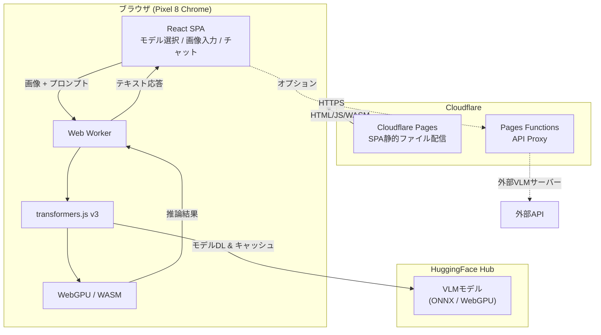
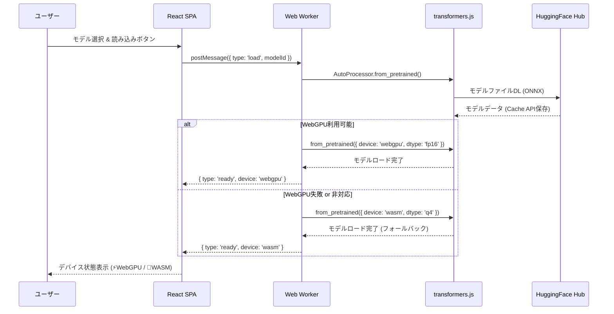
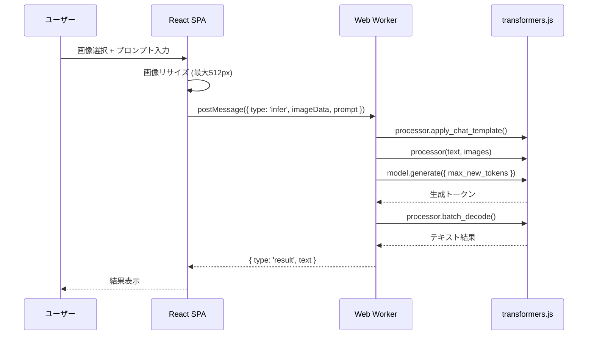
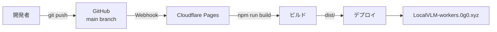

# LocalVLM-workers

これ見てwebでも動くんかなと試し
https://x.com/i/status/2041109577790631975

ブラウザ上でVLM（Vision Language Model）を動作・検証するためのWebアプリケーション。
Cloudflare Workers経由でSPA配信し、WebGPU + transformers.jsでクライアントサイド推論を実行する。

**ターゲットデバイス**: Pixel 8（Tensor G3, RAM 8GB）

**URL**: https://local-vlm-workers.0g0.xyz

## アーキテクチャ



## モデル読み込みフロー



## 推論フロー



## 対応モデル

| モデル | パラメータ数 | 特徴 |
|--------|------------|------|
| **Gemma 4 E2B** ⭐ | 2.3B (実効) | Google製。マルチモーダル。ONNX変換済み。Pixel最適化 |
| SmolVLM-256M | 256M | 最軽量。1GB未満で推論可能 |
| SmolVLM-500M | 500M | 256Mより高精度 |
| SmolVLM2-256M Video | 256M | 動画対応版 |
| SmolVLM2-500M Video | 500M | 動画対応版、高精度 |

全モデルはHuggingFace Hub経由でブラウザにダウンロード・キャッシュされる。

## 技術スタック

- **フロントエンド**: React 19 + TypeScript + Vite
- **VLM実行**: @huggingface/transformers (transformers.js) + WebGPU
- **ホスティング**: Cloudflare Workers / Pages
- **API Proxy**: Cloudflare Pages Functions
- **コード品質**: ESLint + Prettier + TypeScript strict mode

## セットアップ

```bash
# 依存インストール
npm install

# ローカル開発サーバー起動
npm run dev

# ビルド
npm run build

# Cloudflare Workersローカルプレビュー
npm run preview
```

## 開発コマンド

```bash
npm run dev          # Vite開発サーバー
npm run dev:worker   # Wrangler Pagesローカル開発
npm run build        # 本番ビルド
npm run type-check   # TypeScript型チェック
npm run lint         # ESLintチェック
npm run lint:fix     # ESLint自動修正
npm run format       # Prettierフォーマット
npm run check-all    # 全チェック (type-check + lint + build)
npm run preview      # Wrangler Pagesプレビュー
```

## デプロイ

GitHub接続によるCloudflare自動デプロイ。`main`ブランチへのpush/mergeで自動ビルド・デプロイ。

**GitHub Actionsは使用しない。**



## ディレクトリ構成

```
LocalVLM-workers/
├── src/
│   ├── frontend/           # React SPA
│   │   ├── components/     # UIコンポーネント
│   │   ├── hooks/          # カスタムフック (VLM制御)
│   │   ├── workers/        # Web Worker (transformers.js実行)
│   │   ├── App.tsx
│   │   └── main.tsx
│   └── types/              # 共有型定義
├── functions/              # Cloudflare Pages Functions
│   └── api/
│       └── proxy.ts        # API Proxy (CORS処理)
├── public/                 # 静的アセット
├── wrangler.toml           # Cloudflare Workers設定
├── vite.config.ts          # Viteビルド設定
├── CLAUDE.md               # Claude Code設定
└── .claude/rules/          # Claude Codeルールファイル
```

## 既知の問題

- **Android Chrome WebGPU**: SmolVLMでクラッシュする報告あり ([transformers.js #1205](https://github.com/huggingface/transformers.js/issues/1205))。WASM(q4)への自動フォールバックで対応済み
- **初回ロード**: モデルのダウンロードに時間がかかる（256Mモデルで約200MB）。2回目以降はブラウザキャッシュから高速ロード
