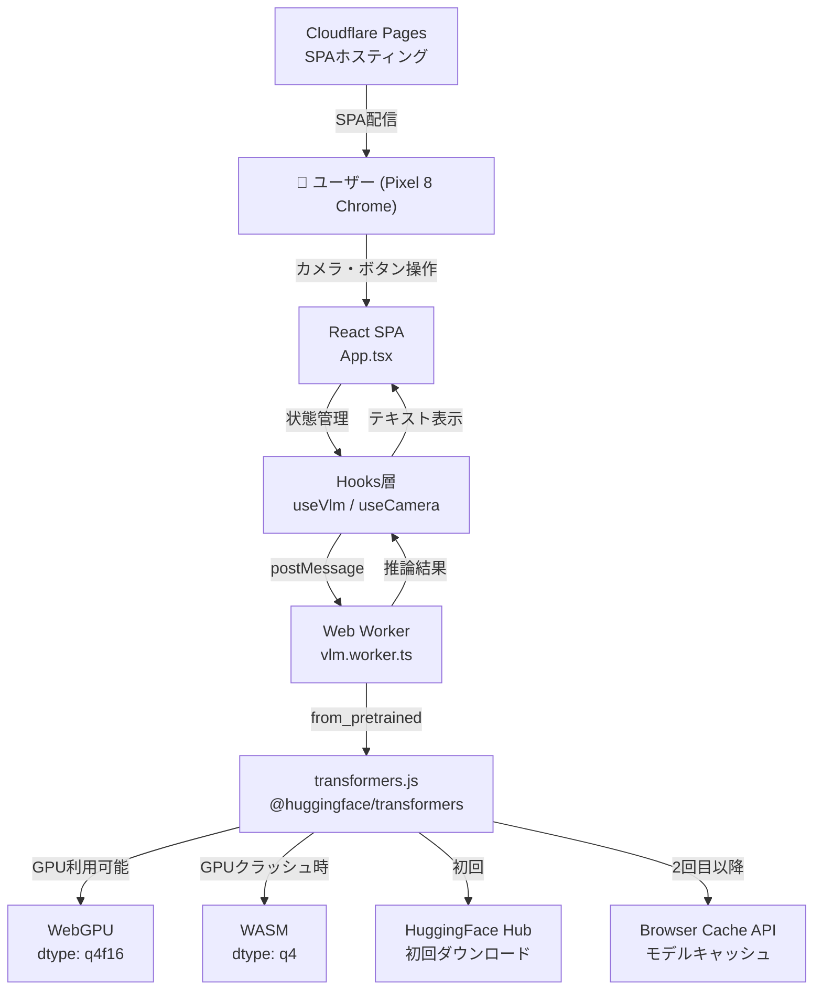
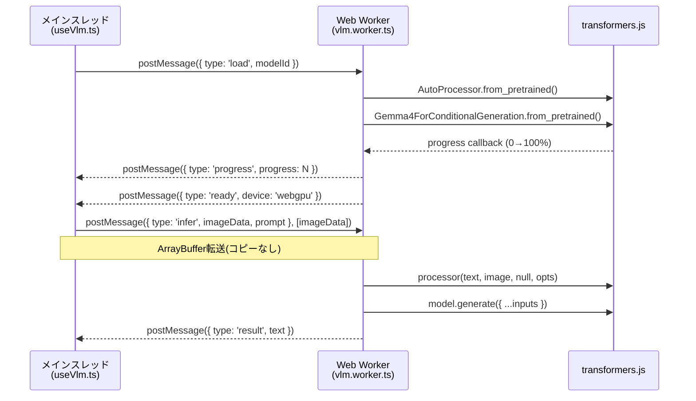
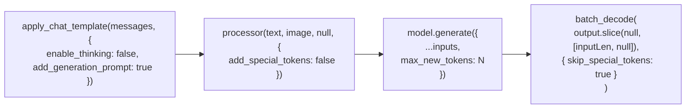
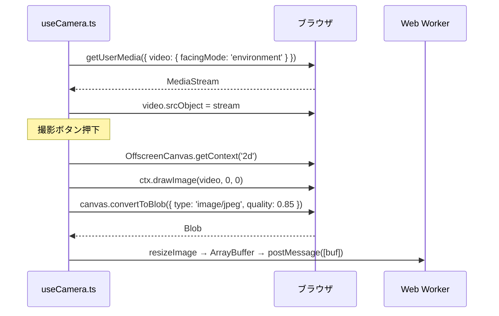
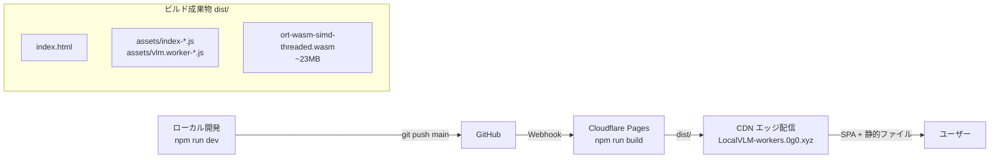
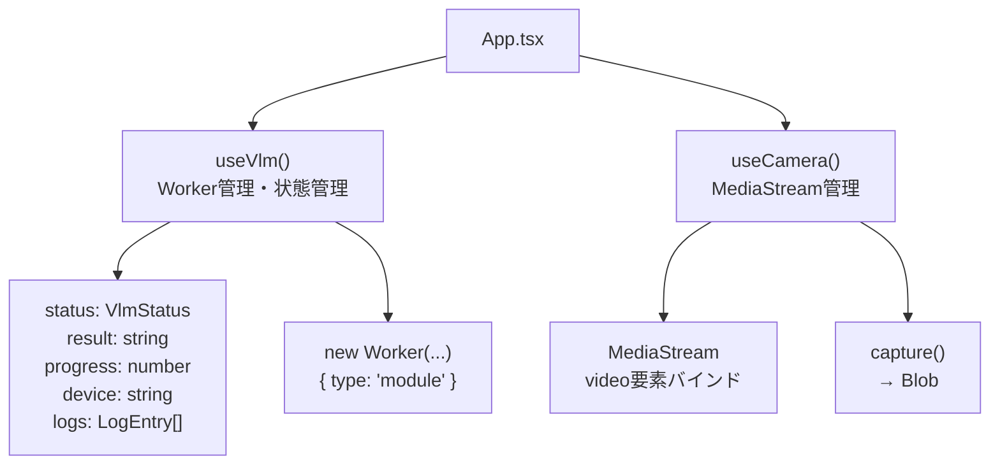
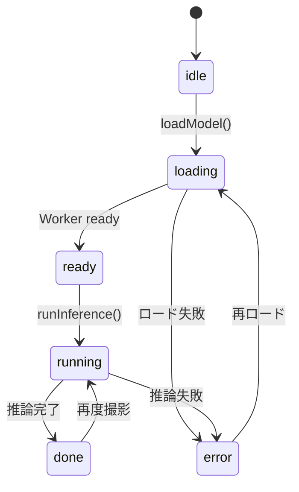
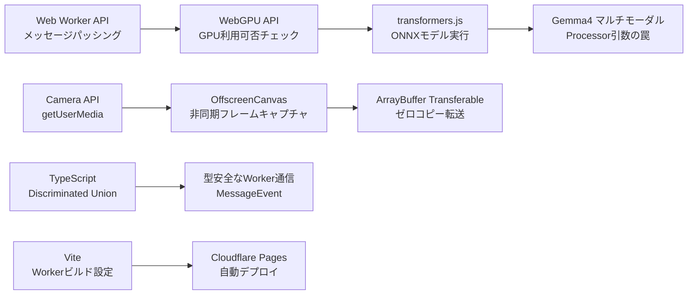

# LocalVLM-workers 学習ガイド

ブラウザ上でVLMをエッジ実行するアーキテクチャを通して学べる技術まとめ。

---

## 1. 全体アーキテクチャ



**ポイント**: サーバーサイド推論ゼロ。ブラウザだけで完結する。

---

## 2. Web Worker 通信設計

UIスレッドをブロックしないために推論をWorkerに分離。



### TypeScript で型安全にする

```typescript
// types/vlm.ts
type VlmWorkerRequest = VlmLoadMessage | VlmInferMessage;
type VlmWorkerResponse = VlmProgressResponse | VlmReadyResponse | VlmResultResponse | VlmErrorResponse;

// vlm.worker.ts — discriminated union で型が絞られる
self.addEventListener('message', (e: MessageEvent<VlmWorkerRequest>) => {
  switch (e.data.type) {
    case 'load':  e.data.modelId  // string 確定
    case 'infer': e.data.imageData // ArrayBuffer 確定
  }
});
```

**`[imageData]` を postMessage の第2引数に渡す** → `Transferable` として所有権移譲。メモリコピーなし。

---

## 3. WebGPU / WASM フォールバック戦略

Android Chrome は WebGPU が不安定なため、自動フォールバックを実装。

```mermaid
flowchart TD
    Start([モデルロード開始]) --> Check{navigator.gpu\n存在する?}
    Check -->|No| WASM
    Check -->|Yes| Adapter{requestAdapter()\n成功?}
    Adapter -->|No| WASM
    Adapter -->|Yes| TryGPU[WebGPU でロード\ndtype: q4f16]
    TryGPU --> GPUResult{成功?}
    GPUResult -->|Yes| ReadyGPU([✅ ready: webgpu])
    GPUResult -->|No: クラッシュ等| Reset[model = null\n500ms 待機 GC]
    Reset --> WASM[WASM でロード\ndtype: q4]
    WASM --> ReadyWASM([✅ ready: wasm])
```

| | WebGPU | WASM |
|---|---|---|
| dtype | q4f16 | q4 |
| 最大トークン | 256 | 128 |
| 速度 | 速い | 遅い |
| 安定性 | Androidで不安定 | 安定 |

---

## 4. Gemma4Processor の正しい使い方

公式ドキュメントには載っていない落とし穴が複数あった。



### 落とし穴まとめ

| 問題 | 原因 | 解決 |
|------|------|------|
| `AudioFeatureExtractor` エラー | `processor(text, [image], opts)` — opts が audio 引数に入った | `processor(text, image, null, opts)` に修正 |
| 命令文が出力に混入 | `enable_thinking: false` 未指定でthinkingモードON | `apply_chat_template` に `enable_thinking: false` 追加 |
| `processor` の型定義がない | transformers.js は `__call__` を型定義していない | `CallableProcessor` インターフェースを自前定義 |

### 正しいシグネチャ

```typescript
// Gemma4Processor._call の実際の引数順
// (text, images, audio, options)
interface CallableProcessor {
  (text: string, image: RawImage, audio: null, opts: Record<string, boolean>): Promise<{ input_ids: Tensor }>;
  apply_chat_template(messages: unknown[], opts: Record<string, boolean>): string;
  batch_decode(tensor: Tensor, opts: Record<string, boolean>): string[];
}
```

---

## 5. Camera API + OffscreenCanvas



- `facingMode: 'environment'` でリアカメラ指定（Pixel 8対応）
- `OffscreenCanvas` でメインスレッドをブロックせずフレーム取得
- `512px` にリサイズしてから推論（VRAMと速度を節約）

---

## 6. Cloudflare Pages デプロイ



- GitHub Actions は **使わない**。Cloudflare の自動ビルドのみ
- WASM ファイルが大きい (~23MB) → CDNキャッシュが効く
- `wrangler.toml` の `[assets]` でSPA配信を設定

---

## 7. React Hooks 設計



### VlmStatus 状態遷移



---

## 8. 学習ロードマップ



### 優先度

| 優先度 | 技術 | 理由 |
|--------|------|------|
| ⭐⭐⭐ | Web Worker + Transferable | ブラウザ並行処理の基礎 |
| ⭐⭐⭐ | transformers.js の推論パイプライン | このプロジェクトの核心 |
| ⭐⭐ | WebGPU / WASMフォールバック | モバイル対応の実践知識 |
| ⭐⭐ | Camera API + OffscreenCanvas | メディア系Webアプリ全般で使える |
| ⭐ | Cloudflare Pages デプロイ | セットアップは済んでいる |
